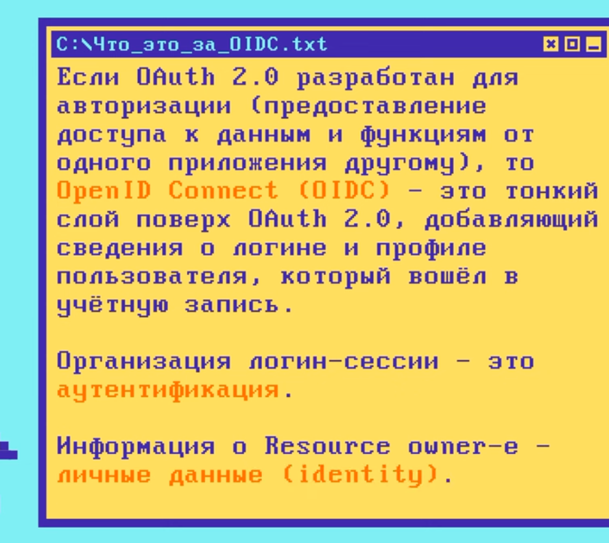
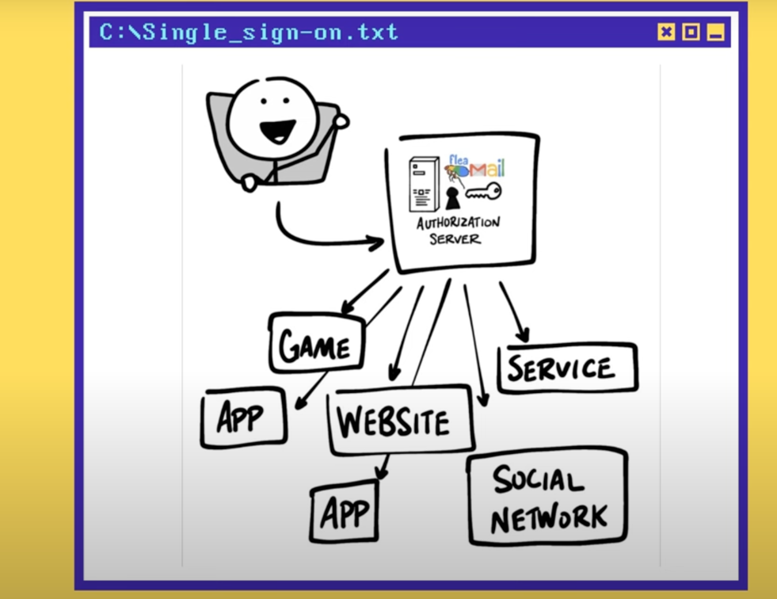

Oauth2 - стандарт безопасности, чтобы одно
приложение могло воспользоваться данными другого приложения

Есть потоки oauth. Наиболее распространенный - oauth2.0

Resource Owner (я по сути, который решает можно ли клиенту испольщовать) \
Client - собственно приложение, которое запрашивает доступ у Authorization Server
Authorization Server - приложение, котороем знает меня == Resource Owner (например гугл) и у которого уже есть учетка \
Resource Server - API, сервис, которым хочет воспользоваться Client от имени Resource Owner
(например API контактов гугла) \
Redirect URI (Callback URL) - ссылка, по которой Authorization Server перенаправит Resource Ownwer (меня) после предоставления разрешения
клиенту \
Response type - тип информации, которую ожидает получить Client (самый распространенный - это Authorization Code) \
Есть Scope - что может делать клиент (читать email, запрашивать контакты и т.д.) \
Consent - когда authorization server спрашивает, готов ли resource ownwer дать scope client \
ClientID - id-шник Client-а на авторизационном сервере (например idшник какого-нибудь приложения в гугле == Authoriaation Server) \
ClientSecret - пароль, который знает только client и authorization server \
Authorization code - временный код (обычно короткий), который Client предоставляет Authorization Server. Authorization Server в свою очередь возвращает
клиенту Access token.  \
Access token - ключ, который будет использовать Client для связи с Resource Server \

Иногда Resource Server и Authorization Server - один и тот же

