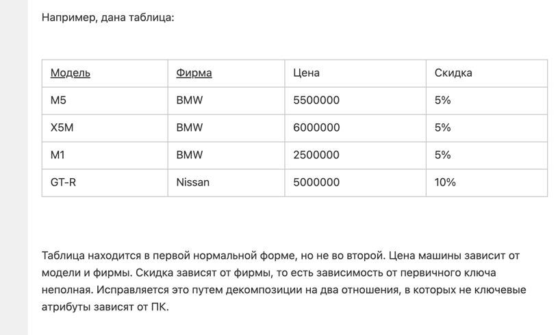
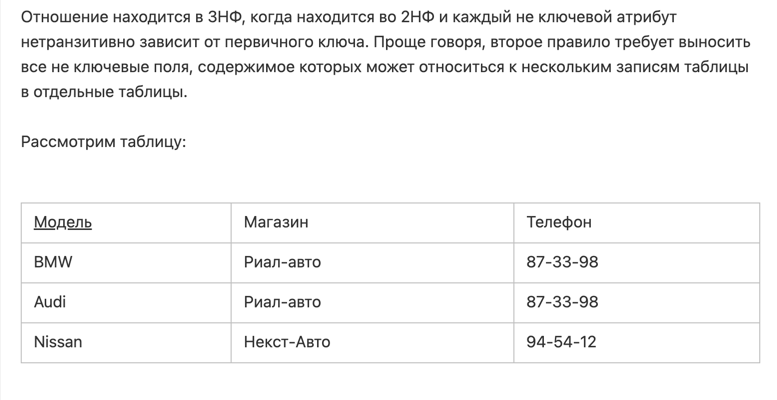

# Их как минимум 6, но на практике обычно используют первые 3. Иногда 4-я (Бойса-Кодда соблюдается автоматически)

## Глобально нормализация нужна для того, чтобы:
- исключить избыточное хранение данных (дублирование) -> меньший объем
- снизить количество потенциальных аномалий в данных (в целом может следовать из первого)
- упрощает работу с базой данных

Чем выше нормализация - тем меньше дублирования данных с одной стороны, но при этом сложнее
читать эти данные. Каждая последующая нормальная форма должна соблюдать условия предыдущей.
Тем самым, в самой последней нормальной форме у нас условно таблица будет состоять из двух
колонок всего (id + уникальное значение сущностей)

### 0NF - про то, что у нас данные в целом представлены в виде колонок и строк

### 1NF - каждая строка уникальная, то есть по сути является ключом + все атрибуты должны быть простыми условно string, varchar и т.д
Тут отношение many-to-many по идее 

### 2NF - соблюдается 1NF + каждый неключевой атрибут НЕПРОВОДИМО зависит от первичного ключа (но при этом может ), то есть
### атрибут должен зависить от всех атрибутов ключа, если ключ составной

>  Вот так оно должно выглядеть

### 3NF - соблюдается 2NF + каждый атрибут не зависит от другого ключевого атрибута - в общем тут просто делим на бизнес-сущности

### Нормальная форма Бойса-Кодда (НФБК) (частная форма третьей нормальной формы)
